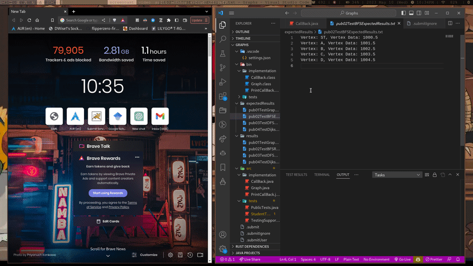

# UMD Submit Server Manager

This is a student-made extension that allows you to submit straight from VSCode instead of having to use Eclipse.

## Unique Features
- See submissions right after submitting, no more manually going to submit.cs.umd.edu and finding the project to release test
  

## Commands

- "Submit to UMD Submit Server"
  - Submits the code in your current project folder to the UMD Submit Server.
  - Accessible from the command palette or right clicking the folder in the explorer.

## Notes

- This is fairly new, so expect some hiccups around new features.

- Don't fret: I actually use this, so I sort of have to maintain it.

## Contact

Anything wrong? Want something added? Create an issue or email me at atmanos@umd.edu !

### **Enjoy!**